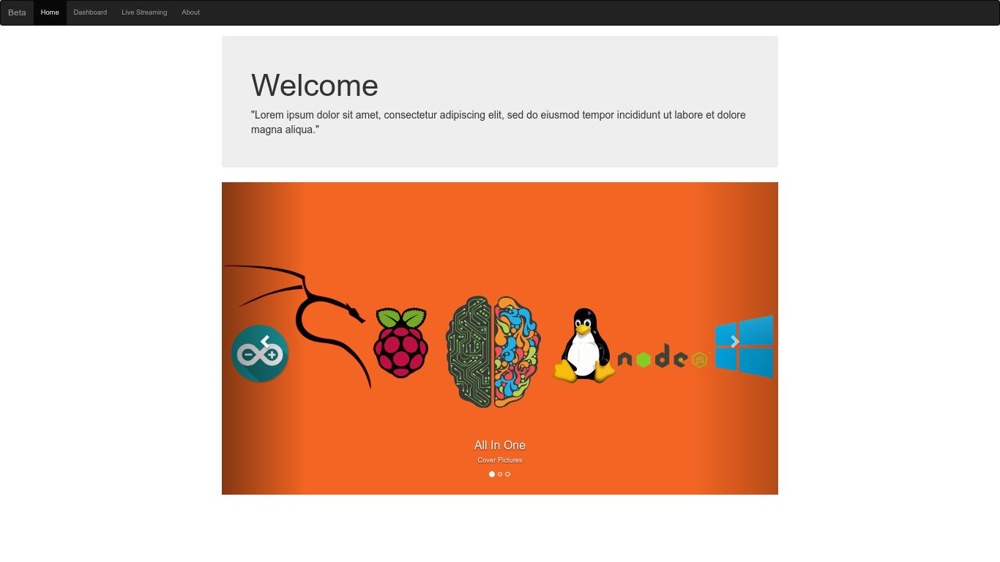
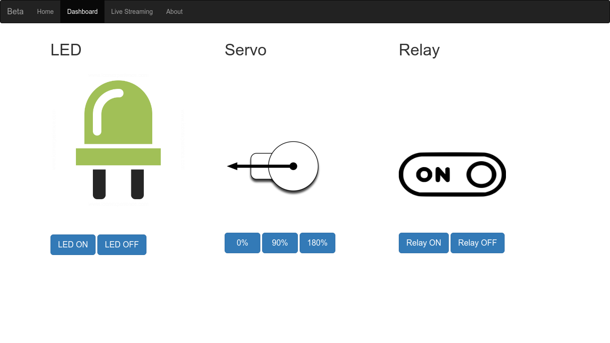
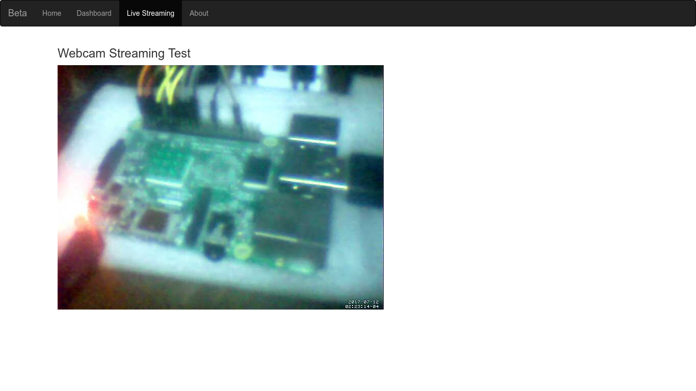
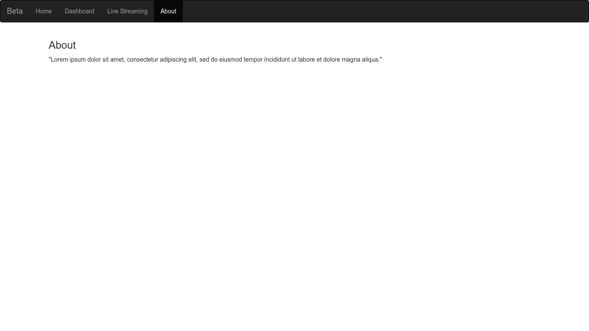

# Pi Web Control

Is a web interface to controle the raspberry pi GPIOs via a webserver.
The idea is to control anything connected to GPIOs, using low level commands written with shell scripts commanded straight from a HTML webpage. 
Not using higher level languages as Python for example, this makes the Pi very responsive because it is recieving the commands from the shell witch is much closer to the OS and the kernel than the other programming languages. For this project I used Lighttpd as the websever, it's a light weight webserver designed and optimized for high performance environments with a small memory footprint compared to other web-servers like apache or nginx.

## How it works
The website is composed of four different HTML pages
### index.html
The main page that loads on startup. You can change it to put whatever you want in it, here I've put a Carousel slideshow, you can replace the images in the carousel with your own images, to do so go to the images folder and replace the existing images with yours and name them 1.png 2.png and 3.jpg make sure your images are in the same format.

### dashboard.html
This is where all your buttons and controls will be. when a user clicks a button an **onclick** event happens, we take that event and link it to a function so when a user clicks a button that function executes, it will send a request to the webserver (the raspberry pi) to open and executes a file and that file contains the command that will control the GPIO.

### streaming.html
Here you'll find your Pi's webcam streaming video, for this to work you must change the code in streaming.html page: in the **<iframe>** tag go to the src attribute and change <Your Pi's IP Here> with your Pi's IP.

### about.html
Here you can put information about your project and its version.

##Known issues
When reloading the page the images come back to their initial state 
and doesn't sync.
For the moment I can't use gpio shell commands to read an input on the gpio then serve it on the webpage. So this Method is only for controlling outputs. For reading inputs you might want to use flask or node js. The only input here is the webcam video streaming.
## License
This project is licensed under the terms of the MIT license.
